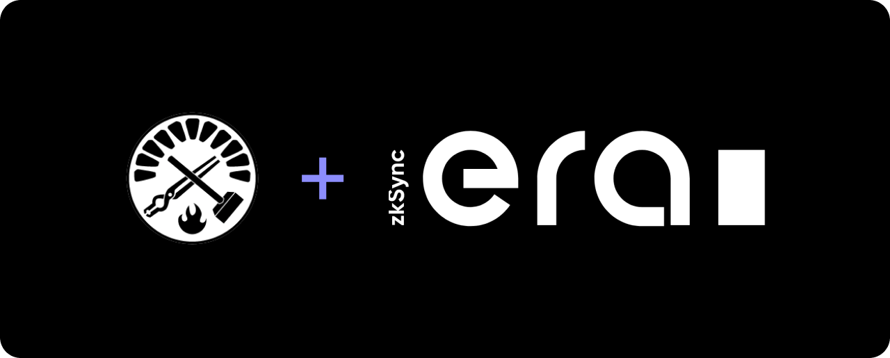

# Foundry Plugin for zkSync Era



## Overview

This plugin allows for the compilation & deployment of contracts to the zkSync Era network within a foundry project. zkSync Era uses a custom compiler and deployment process different from other EVM networks, this plugin simplifies this process.

## Requirements

This plugin assumes you have [solc](https://docs.soliditylang.org/en/latest/installing-solidity.html) installed and in your path.

## Installation / Setup

Install this project as a dependancy:

```sh
forge install omurovec/foundry-zksync-era
```

Import `Deployer.sol` into your deployment script and use as follows:

```solidity
// Script.s.sol

import "lib/foundry-zksync-era/Deployer.sol";

...

// Provide zkSync compiler version and address of the diamond proxy on L1
Deployer deployer = new Deployer("1.3.4", address(0x1908e2BF4a88F91E4eF0DC72f02b8Ea36BEa2319));

// Provide path to contract, input params, salt & whether it should be broadcasted
// Returns deployment address on L2
deployer.deployFromL1("src/Counter.sol", new bytes(0), bytes32(uint256(1337)), true);
```

> Note: The Diamond Proxy address is the address of the L1 contract that handles all interactions with the zkSync network. At the time of writing, the diamond proxy for goerli was used in the example however this can change after regenesis & other network upgrades. This address will always be the same as the bridge and can be found by attempting to bridge assets at https://portal.zksync.io/bridge

Ensure the following values are in your env:

```sh
PRIVATE_KEY=""
OS="" # macosx | windows | linux
ARCH="" # arm64 | amd64
```

Enable read/write permissions in your `foundry.toml`:

```toml
fs_permissions = [{ access = "read-write", path = "./"}]
```

Deploy your contracts using the script you created:

```sh
forge script scripts/Script.s.sol --ffi --broadcast --rpc-url L1_RPC_URL
```

The transaction hash of the deployment on L2 will be returned by the broadcast. It is dependant on the block timestamp so it can not be accurately derrived within the script (before execution).

> Note: It's also recommended to add `lib/zksolc*` to your project's `.gitignore`

## Notes

This is a work in progress so it does not have all the features of it's counterparty [hardhat-zksync](https://github.com/matter-labs/hardhat-zksync). Some things to note:

- This project currently **only supports deployment from L1**. Direct deployment from L2 requires custom data to be passed in to the EIP-712 transaction (see [zkSync docs](https://era.zksync.io/docs/api/api.html#eip712)).

- The `_l2GasLimit` & `_l2GasPerPubdataByteLimit` params for `requestL2Transaction()` are currently hardcoded to their max values for convenience.

## Contribution

This has just been a quick passion project so far but would love any help on making this a more feature rich project & a go-to for anyone using foundry + zksync era so feel free to open any issues or PRs that you think would be useful.
